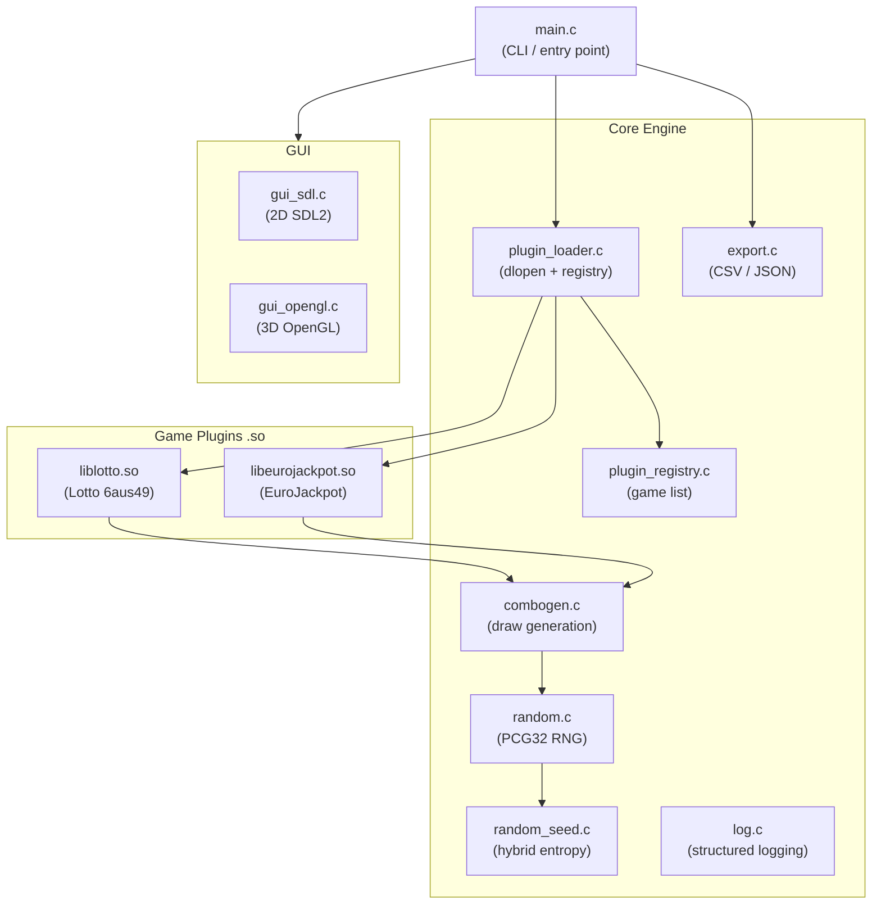

Open‑Lotto

A modular, high‑entropy lottery number generator written in C.

Open‑Lotto is a plugin‑based lottery engine designed with clean architecture, strong randomness guarantees, and extensibility in mind. It uses a hybrid entropy source, a PCG32 random generator, and dynamically loaded plugins to simulate real lottery draws with accuracy and style.

🚀 Features

🔐 Hybrid RNG Seeding

Every draw uses a high‑quality seed built from:

Linux kernel entropy (getrandom())

Hardware entropy (RDRAND) when supported

Monotonic clock jitter

These sources are XOR‑combined to produce a robust, unpredictable seed for each draw.

🎲 PCG32 Random Number Generator

Open‑Lotto uses PCG32, a modern, fast, statistically strong RNG suitable for simulations and Monte‑Carlo‑style workloads.

🔌 Plugin‑Based Game System

Each lottery game is implemented as a shared library (.so) that defines:

Main number range

Extra number range (if any)

Number of picks

Game name

Plugins are discovered automatically at runtime.

🎞 Animated Draw Mode

Enable --animate to watch numbers roll in with a smooth terminal spinner animation.

📦 Multiple Draws

Generate any number of independent draws:

./open-lotto --game lotto --draws 10

📦 Dependencies

The following packages are required to build open‑lotto:

| Dependency | Min version | Purpose |
|---|---|---|
| **CMake** | 3.10 | Build system |
| **GCC** or **Clang** | C11 support | C compiler |
| **make** | any | Build driver |
| **pkg-config** | any | Library discovery |
| **SDL2** | 2.0 | 2D GUI rendering and event loop |
| **SDL2_ttf** | 2.0 | Font rendering in the SDL2 GUI |
| **OpenGL / Mesa** | any | 3D drum simulation (`gui_opengl.c`) |

### Quick install (recommended)

Run the bundled helper script — it detects your OS and installs everything automatically:

```bash
./scripts/install_deps.sh
```

Supported platforms: Ubuntu/Debian, Fedora, RHEL/CentOS/Rocky/Alma, Arch/Manjaro, openSUSE, macOS (Homebrew).

### Manual install

**Ubuntu / Debian / Pop!_OS / Linux Mint**
```bash
sudo apt-get update
sudo apt-get install -y build-essential cmake pkg-config \
    libsdl2-dev libsdl2-ttf-dev libgl-dev mesa-common-dev
```

**Fedora**
```bash
sudo dnf install -y gcc cmake pkgconf-pkg-config make \
    SDL2-devel SDL2_ttf-devel mesa-libGL-devel
```

**Arch Linux / Manjaro**
```bash
sudo pacman -S base-devel cmake pkgconf sdl2 sdl2_ttf mesa
```

**macOS (Homebrew)**
```bash
brew install cmake sdl2 sdl2_ttf pkg-config
# OpenGL is provided by the macOS SDK — no extra package needed
```

> **Missing dependency?**  If `cmake ..` fails with a *not found* error the
> CMake output will print the exact install command for your platform.

---

📦 Build Instructions

mkdir build
cd build
cmake ..
make -j

> **Cross-build environment (Buildroot / Yocto / ROS)?**  
> If another project has overridden `PKG_CONFIG_PATH` in your shell, CMake may
> not find the system SDL2/OpenGL libraries even though they are installed.
> Use the configure wrapper instead of calling `cmake` directly:
> ```bash
> ./scripts/configure.sh        # → writes into build/
> cmake --build build -j
> ```

This produces:

open-lotto
plugins/
    liblotto.so
    libeurojackpot.so

🕹 Usage

List available games

./open-lotto --list-games

Run a game

./open-lotto --game lotto

Animated draw

./open-lotto --game eurojackpot --animate

Multiple draws

./open-lotto --game lotto --draws 7

Combine options

./open-lotto --game lotto --animate --draws 5

🧩 Plugin Architecture

Each plugin must implement two functions:

const LotteryInfo* lottery_get_info(void);
void lottery_generate(LotteryResult *out, draw_event_callback cb);

Plugins are compiled as shared libraries and placed in:

```
build/plugins/
```

The loader extracts the game name from the plugin metadata, not from the .so filename.

Example plugin structure
```
plugins/
├── lotto.c
└── eurojackpot.c
```

🔧 RNG Architecture

Hybrid Seed Generation

The seed is built from:

getrandom() (primary entropy)

RDRAND (if CPU supports it)

CLOCK_MONOTONIC timestamp

Random Number Generation

Open‑Lotto uses:

PCG32 for main RNG

Fisher–Yates shuffle for pool randomization

This combination ensures:

High entropy

Uniform distribution

No repetition within a draw

Fast performance

🏗 Architecture



Each game plugin is a self-contained `.so` that implements the `lottery_plugin.h` interface.
The core engine never imports game-specific logic — plugins are discovered and loaded at
runtime by `plugin_loader`.

| Component | Responsibility |
|-----------|---------------|
| `main.c` | Parse CLI flags, select GUI mode, orchestrate draw loop |
| `plugin_loader.c` | Scan `plugins/` directory, `dlopen` each `.so`, resolve symbols |
| `plugin_registry.c` | Central list of loaded game plugins |
| `combogen.c` | Fisher-Yates draw of main + extra numbers; event callback hook |
| `random.c` | PCG32 random number generator |
| `random_seed.c` | Hybrid entropy from `getrandom()`, RDRAND, and monotonic clock jitter |
| `export.c` | Serialize results to CSV or JSON |
| `gui_sdl.c` | 2D animated draw display via SDL2 + SDL_ttf |
| `gui_opengl.c` | 3D drum simulation — dual `DrumInstance` physics + OpenGL rendering |

📁 Project Structure
```
open-lotto/
├── include/          # Public headers (plugin ABI, combogen, RNG, …)
├── src/              # Core engine source files
├── plugins/          # Game plugin source files (compiled to .so)
├── tests/            # Unit tests and benchmarks
├── docs/
│   ├── adr/          # Architecture Decision Records
│   └── api/          # Generated Doxygen HTML (gitignored)
├── scripts/          # Developer utility scripts
├── CMakeLists.txt
└── README.md
```

📜 License

MIT License.

👤 Author

WissemEmbedded Linux Developer & Firmware ArchitectSaxony, Germany

🤝 Contributions

Contributions, new lottery plugins, and improvements are welcome!

**Getting started?** See [CONTRIBUTING.md](CONTRIBUTING.md) for:
- How to build locally
- How to write new lottery plugins
- Code style and testing requirements
- How to submit pull requests

**Writing a plugin?** See [docs/plugin-guide.md](docs/plugin-guide.md) for a step-by-step guide with a full example.

**Architecture decisions?** See [docs/adr/](docs/adr/) for Architecture Decision Records covering the plugin system, ball physics, and GUI rendering.

Feel free to open issues or submit pull requests. All contributions are valued!

❤️ Support the Project
Open‑Lotto is a passion‑driven project that I build and maintain in my free time. If you find it useful, enjoy the transparency behind the engine, or want to help accelerate development, your support makes a real difference.

https://github.com/sponsors/Boussetta

Your contribution helps me dedicate more time to improving the system, adding new features, and keeping the project open for everyone.

Thank you for supporting independent open‑source work.